# Flask Application Dockerization Project

## Project Overview

This project demonstrates how to containerize a Python Flask application using Docker. The application was deployed and tested on an Ubuntu EC2 instance, showcasing both single-stage and multi-stage Docker builds along with Docker Compose.

## Technologies Used

* Python
* Flask
* Docker
* Docker Compose
* Ubuntu EC2

---

## Project Objectives

* Create a custom Dockerfile for a Flask application
* Build and run Docker containers
* Understand Docker image layers and caching
* Implement a multi-stage Docker build
* Compare image sizes between single-stage and multi-stage builds
* Manage containers using Docker Compose

---

## Project Structure

```text
flask-app-ecs/
├── app.py
├── run.py
├── requirements.txt
├── Dockerfile
├── Dockerfile-multi
├── docker-compose.yml
└── screenshots/
```

---

## Single Stage Dockerfile

Created a Dockerfile using the official Python Slim image.

Key steps:

* Used Python 3.14 Slim as the base image
* Set the working directory
* Installed application dependencies
* Copied application source code
* Exposed port 80
* Started the Flask application

---

## Multi-Stage Dockerfile

Created a multi-stage Docker build to separate dependency installation from the runtime environment.

Benefits:

* Cleaner image structure
* Better build organization
* Improved Dockerfile practices
* Foundation for production-grade containerization

---

## Docker Compose

Created a Docker Compose configuration to simplify container deployment and management.

Features:

* Single command deployment
* Container lifecycle management
* Consistent runtime configuration

---

## Screenshots

### 1. Dockerfile Created

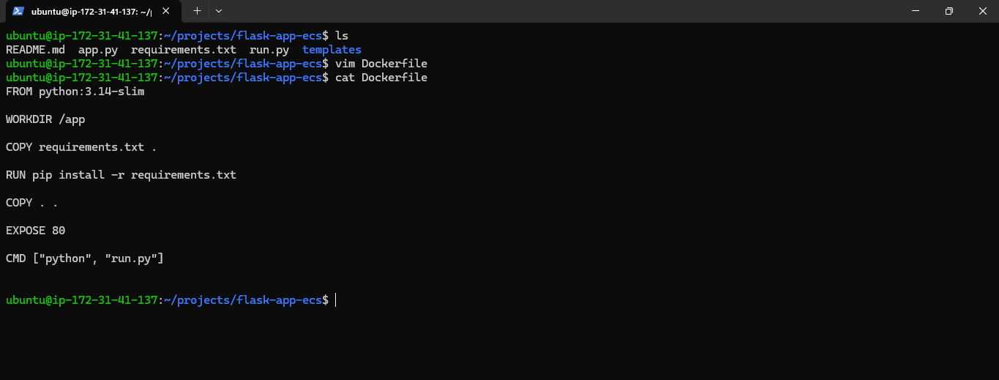

### 2. Docker Image Built

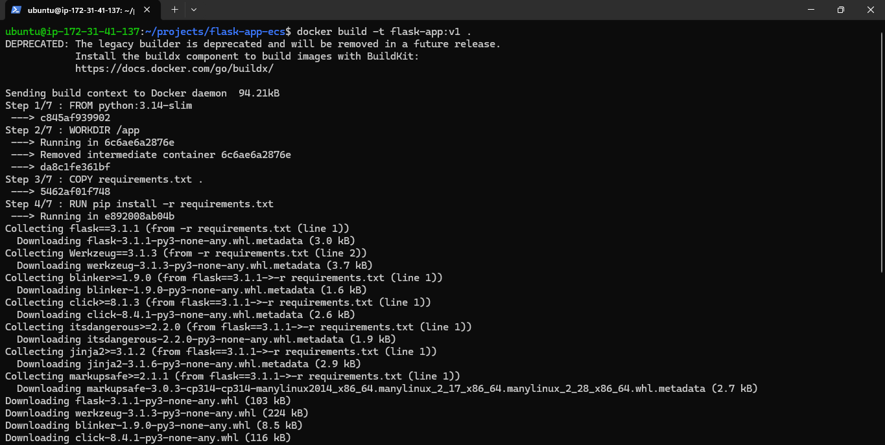

### 3. Docker Image Verified

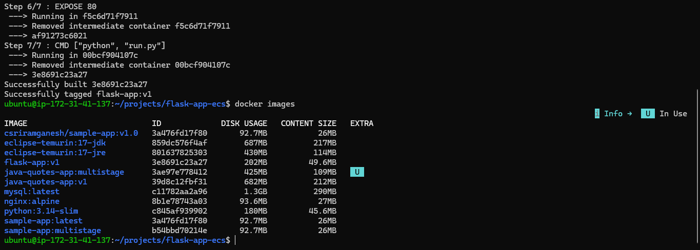

### 4. Container Running

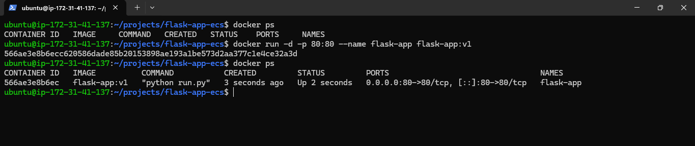

### 5. Application Running in Browser

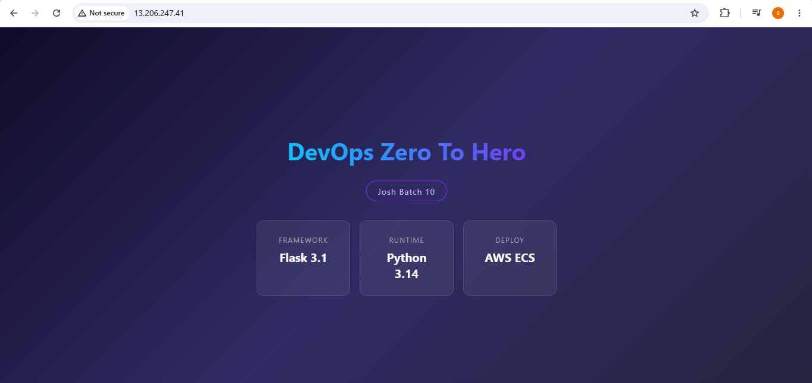

### 6. Multi-Stage Dockerfile Created

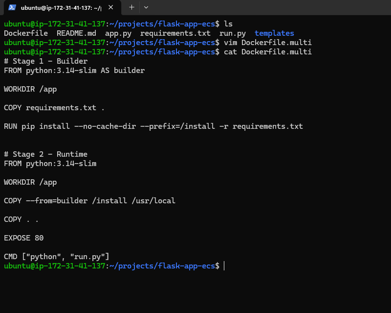

### 7. Multi-Stage Image Built

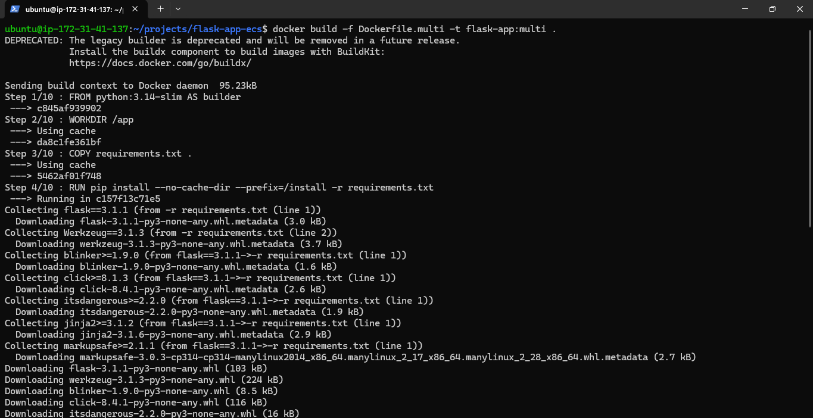

### 8. Image Size Comparison

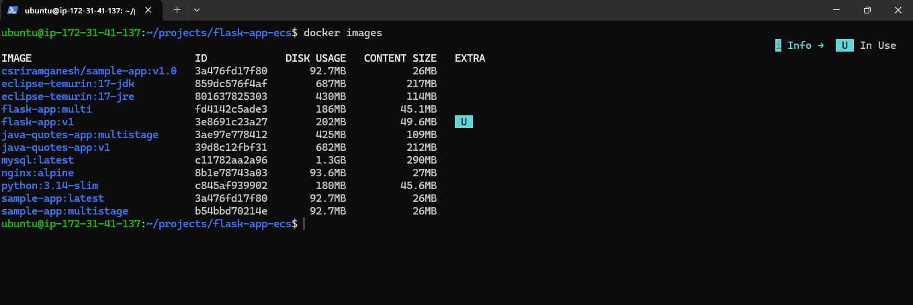

### 9. Multi-Stage Container Running

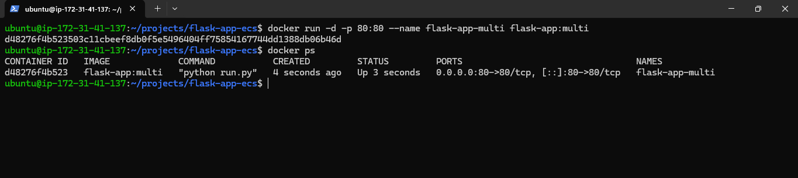

### 10. Docker Compose Configuration

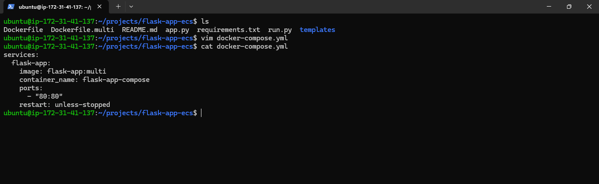

### 11. Docker Compose Deployment

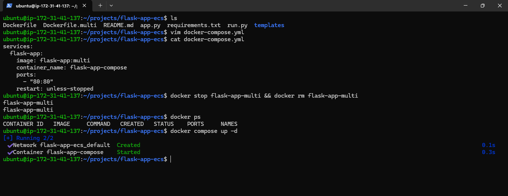

---

## Commands Used

### Build Single Stage Image

```bash
docker build -t flask-app:v1 .
```

### Run Container

```bash
docker run -d --name flask-app -p 80:80 flask-app:v1
```

### Build Multi-Stage Image

```bash
docker build -f Dockerfile.multi -t flask-app:multi .
```

### Run Multi-Stage Container

```bash
docker run -d --name flask-app-multi -p 80:80 flask-app:multi
```

### Deploy Using Docker Compose

```bash
docker compose up -d
```

### Stop Docker Compose Services

```bash
docker compose down
```

---

## Learning Outcomes

Through this project, I learned:

* Docker image creation
* Container lifecycle management
* Dockerfile best practices
* Multi-stage Docker builds
* Image optimization concepts
* Docker Compose fundamentals
* Running containerized applications on Linux servers

---

## Author

Sriram Ganesh

GitHub: https://github.com/csriramganesh

